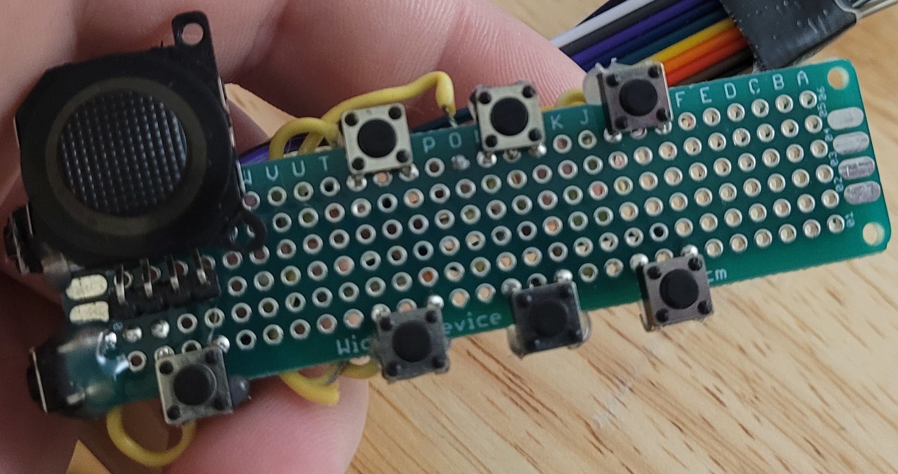
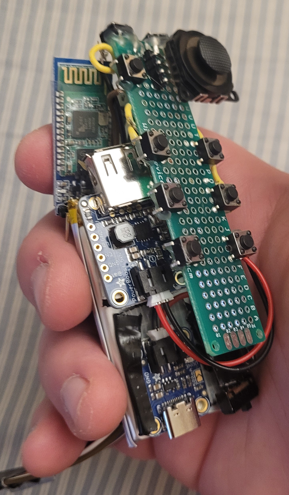

# Hudl Remot

## Description

The software repo for a cheap alternative to the Hudl remote devices

Hudl remotes are used by Coaches all over the country (world?), and they're incredibly expensive at \$200, despite being some cheap plastic and some buttons. I think I can 1) open source this and 2) make it significantly cheaper, no more than maybe $50

## Bill of Materials

This is the approximate cost of building it for myself.
Note that were it mass-produced, cost would almost certainly be even cheaper

| Item | Quantity | Total Price |
|:----:|:--------:|:-----------:|
| Raspberry Pi Pico microcontrollers | 2 | $8 |
| HC-05 Bluetooth modules | 2 | $4.66 |
| 6mm Push-Buttons | 9 | $0.42 |
| 3.7v Lipo Battery 1200mAh | 1 | $9.95 |
| USB-C Lipo charger | 1 | $5.95 |
| PowerBoost 500 Basic | 1 | $9.95 |
| JST PH 2-Pin Cable | 1 | $0.75 |
| Thumb Stick | 1 | $2.50
| Switch | 1 | $0.95 |
| __Total__ | __1__ | __$43.13__ |

This also doesn't take into account the cost of solder used, wire used, or the enclosure.

## System diagram

## Internal Systems

Power system comprised of battery, power switch, charger, and 5V booster:

HC-05 bluetooth module:

Controls system comprised of 9 buttons and a PSP thumbstick:

Rough holding together of components:

## Pico Stuff/Project layout

Unfortunately, the pico uses the Cmake build system which is an utter piece of garbage, so you'll have to deal with that to build the project. Sorry. Nothing I can do.

The project is separated into two parts:
 * The HID device which acts as a mouse and keyboard on the computer to control Hudl
 * The Physical device which takes button and PSP thumbstick inputs and sends them to the HID device

Now, the Pico is overkill for this project. However, at $4, it's not unreasonable to use them, so why the heck not?

To install needed dependencies (on Debian) run `sudo make install-deps`
To build the two board files run `make`
